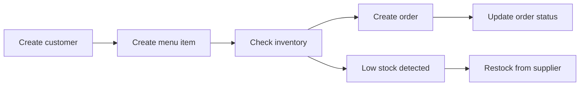
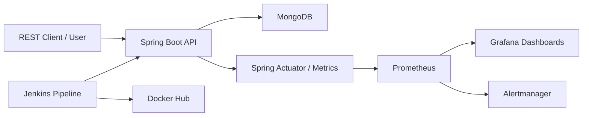
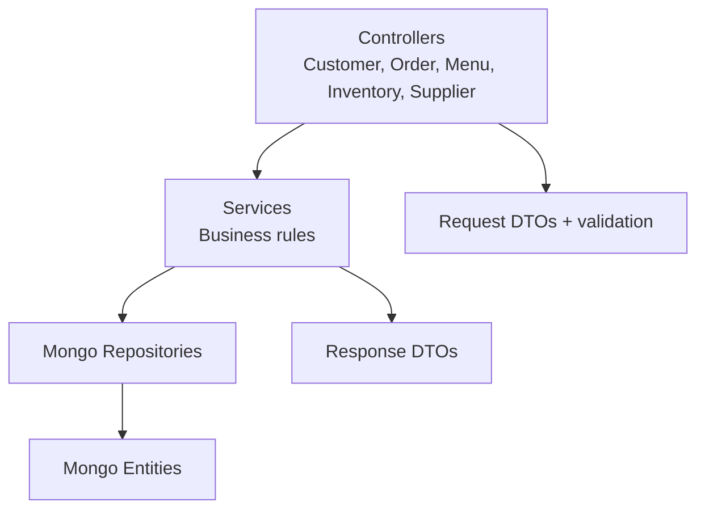
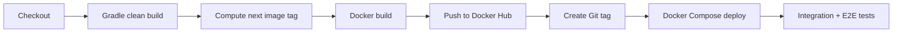

# KitchenFlow Colocviu Presentation Skeleton

Goal: 10 minute PowerPoint presentation for the Production Engineering colocviu.

Rubric covered: theme, MVP use cases, high-level design, low-level design, metrics, alerts, dashboards, AI usage, team work.

Recommended deck length: 10-12 slides. Keep 45-60 seconds per main slide.

## Slide 1 - Title

**Title:** KitchenFlow - Restaurant Operations API

**Subtitle:** Production Engineering Colocviu

**On slide**
- Team: Stoinoiu Alexandru, Ristea Alexandru
- Stack: Spring Boot, MongoDB, Docker, Jenkins, Prometheus, Grafana
- One-line pitch: KitchenFlow helps restaurants manage customers, orders, menu items, inventory, and suppliers through one REST API.

**Image to add**
- Simple product-style cover image: restaurant kitchen / order flow / dashboard screenshot.
- Optional: logo-like text "KitchenFlow".

**Speaker notes**
- Introduce the project as a backend SaaS-style restaurant management platform.
- Say this presentation follows the colocviu requested topics: product, architecture, observability, CI/CD, AI, teamwork.

**Time:** 30 sec

## Slide 2 - Problem and Theme

**Title:** Problem: Restaurant Operations Split Across Flows

**On slide**
- Restaurants must coordinate customers, menu, stock, and suppliers.
- Orders affect inventory.
- Low stock must trigger restocking.
- Supplier restocks must keep menu items available.

**Image to add**
- One flow graphic:
  `Customer -> Order -> Menu Item -> Inventory -> Supplier`

**Speaker notes**
- KitchenFlow models the restaurant as a central system connecting customer demand with inventory and supplier supply.
- The important idea is not only CRUD, but also operational consistency: orders and inventory are connected.

**Time:** 45 sec

## Slide 3 - MVP Use Cases

**Title:** MVP Use Cases

**On slide**
1. Customer management
   - create, get, update, delete customers
2. Order management
   - create orders, list by customer, update status
3. Menu management
   - create menu items with ingredient requirements
4. Inventory management
   - track stock, detect low stock, restock
5. Supplier management
   - manage supplier records used for inventory restocking

**Image to add**
- Use case diagram or five icons: Customer, Order, Menu, Inventory, Supplier.

**Speaker notes**
- Split by team ownership:
  - Stoinoiu Alexandru: Customer and Order Management
  - Ristea Alexandru: Menu, Inventory, Supplier Management

**Time:** 60 sec

## Slide 4 - User Flow Demo Story

**Title:** Main Business Flow

**On slide**


**Image to add**
- Screenshot from `requests.http` or Postman/REST Client showing one successful API call.
- Optional: screen recording frame of API response.

**Speaker notes**
- The happy path: customer exists, menu item exists, inventory supports the order, order is created, status changes through lifecycle.
- Inventory and supplier APIs support the operational side.

**Time:** 60 sec

## Slide 5 - High-Level Architecture

**Title:** High-Level Architecture

**On slide**


**Image to add**
- Existing image: `documentation/high-level-monitoring-diagram.png`
- If too detailed, make a simplified PowerPoint version from the Mermaid diagram above.

**Speaker notes**
- Runtime path: clients call Spring Boot, app reads/writes MongoDB.
- Observability path: actuator and exporters expose metrics, Prometheus scrapes, Grafana visualizes, Alertmanager handles alerts.
- Delivery path: Jenkins builds and deploys Docker images.

**Time:** 60 sec

## Slide 6 - Low-Level Design

**Title:** Low-Level Backend Design

**On slide**


**Key classes**
- Controllers: `CustomerController`, `OrderController`, `MenuController`, `InventoryController`, `SupplierController`
- Services: business logic and validation
- Repositories: MongoDB persistence
- DTOs: request/response separation

**Image to add**
- Small package diagram.
- Screenshot from project tree showing `controller`, `service`, `repository`, `model`, `request`, `response`.

**Speaker notes**
- The design follows Spring Boot layering.
- Controllers handle HTTP and validation.
- Services own business behavior.
- Repositories isolate persistence.
- DTOs avoid leaking persistence entities to clients.

**Time:** 60 sec

## Slide 7 - Testing Strategy

**Title:** Testing: Unit, Integration, E2E

**On slide**
- Unit tests: services with mocked repositories.
- Controller tests: MockMvc HTTP behavior.
- Integration tests: Spring Boot + Testcontainers MongoDB.
- E2E tests: Cucumber scenarios against running API.
- Performance tests: JMeter plan for customer API.

**Image to add**
- Screenshot of passing Gradle/Jenkins test stage.
- Screenshot of Cucumber report: `build/reports/cucumber/cucumber-report.html`.
- Optional: JMeter summary report with 0% errors.

**Speaker notes**
- Unit tests protect business logic.
- Integration tests verify real MongoDB behavior.
- E2E tests verify actual HTTP user flow.
- This gives confidence before Docker image publication and deployment.

**Time:** 50 sec

## Slide 8 - CI/CD Pipeline

**Title:** Jenkins CI/CD Pipeline

**On slide**


**Image to add**
- Jenkins successful pipeline screenshot.
- Docker Hub tags screenshot.
- GitHub tags screenshot.

**Speaker notes**
- Lab 6: Jenkins CI builds and pushes Docker image.
- Lab 7: CD adds versioning, Git tags, deployment, integration tests, and E2E tests.
- Jenkins credentials hide Docker Hub and GitHub tokens.

**Time:** 60 sec

## Slide 9 - Metrics

**Title:** Metrics Collected

**On slide**
- App metrics from Spring Boot Actuator / Micrometer.
- JVM metrics: heap, non-heap, GC, threads, CPU.
- HTTP metrics: request rate, counters, response time.
- Repository metrics: Spring Data repository invocation timings.
- Container metrics from cAdvisor.
- Prometheus internal scrape metrics.

**Image to add**
- Grafana `SpringBoot APM Dashboard` screenshot.
- Grafana `Prod Eng App Monitoring` screenshot.
- Grafana `Cadvisor exporter` screenshot.

**Speaker notes**
- Metrics are not only for graphs; they show whether the service is healthy under load.
- The dashboards cover app internals, request behavior, and container health.

**Time:** 50 sec

## Slide 10 - Alerts and Dashboards

**Title:** Alerts and Dashboards

**On slide**
Alerts implemented:
- `WARNING-HighThroughput`: high request rate warning.
- `CRITICAL-HighThroughput`: very high request rate critical alert.
- `WARNING-NoThroughout`: no throughput canary alert.
- Application container down alerts.
- Traffic injector container alerts.

Dashboards:
- Prod Eng App Monitoring
- SpringBoot APM Dashboard
- Prometheus Stats
- Loki Stack Monitoring
- cAdvisor Container Dashboard

**Image to add**
- Prometheus alerts page screenshot.
- Alertmanager screenshot.
- Grafana dashboard panel screenshot.

**Speaker notes**
- Warning alerts show early risk.
- Critical alerts show conditions needing immediate attention.
- Dashboards help debug whether issue is app-level, DB/container-level, or monitoring-stack-level.

**Time:** 60 sec

## Slide 11 - AI Usage

**Title:** How We Used AI

**On slide**
- Code generation support for repetitive Spring layers.
- Test scenario brainstorming and edge case discovery.
- CI/CD debugging help for Jenkinsfile, Docker Compose, and environment issues.
- Documentation drafting and presentation skeleton.
- AI was used as assistant; final code was reviewed, run, and adapted by team.

**Image to add**
- Screenshot/diagram: "Developer -> AI assistant -> Review -> Code/Test".
- Optional: small before/after snippet where AI helped refactor or document.

**Speaker notes**
- Be honest: AI helped accelerate boilerplate and debugging, but decisions stayed with the team.
- Mention concrete examples:
  - creating E2E Cucumber test structure
  - improving Jenkins pipeline
  - explaining failures from Gradle/Jenkins/Docker

**Time:** 45 sec

## Slide 12 - Teamwork and Lessons Learned

**Title:** Teamwork and Lessons Learned

**On slide**
Team split:
- Stoinoiu Alexandru: customers, orders, CI/CD, E2E improvements.
- Ristea Alexandru: menu, inventory, suppliers, monitoring support.

Workflow:
- feature branches
- pull requests
- shared documentation
- local verification
- Jenkins pipeline verification

Lessons:
- CI/CD needs correct secrets and reproducible Docker config.
- Observability helps explain failures faster.
- E2E tests catch real API wiring issues.
- Small, layered architecture made feature work easier to split.

**Image to add**
- GitHub commits/PRs screenshot.
- Jenkins branch scan screenshot.
- Team contribution table.

**Speaker notes**
- End with what worked and what you would improve next:
  - stronger business metrics
  - authentication
  - production database configuration
  - Kubernetes deployment hardening

**Time:** 60 sec

## Slide 13 - Backup: Demo Checklist

Use only if time allows or during questions.

**Demo path**
1. Show app running:
   - `http://localhost:8080/actuator/health`
2. Create customer.
3. Create order.
4. Query orders by email.
5. Show Jenkins build.
6. Show Grafana dashboard.

**Commands**
```powershell
docker compose --profile mongo up -d mongo
$env:E2E_BASE_URL="http://localhost:8080"
.\gradlew.bat testE2E
```

**PowerPoint image checklist**
- Cover image or KitchenFlow title graphic.
- MVP use case diagram.
- Business flow diagram.
- High-level architecture diagram.
- Low-level package/layer diagram.
- Jenkins pipeline screenshot.
- Docker Hub tag screenshot.
- GitHub tag screenshot.
- Grafana dashboard screenshot.
- Prometheus alerts screenshot.
- Cucumber report screenshot.
- Team workflow screenshot.

## Suggested 10 Minute Timing

| Slide | Topic | Time |
|---|---|---:|
| 1 | Title | 0:30 |
| 2 | Problem/theme | 0:45 |
| 3 | MVP use cases | 1:00 |
| 4 | Main flow | 1:00 |
| 5 | High-level design | 1:00 |
| 6 | Low-level design | 1:00 |
| 7 | Testing | 0:50 |
| 8 | CI/CD | 1:00 |
| 9 | Metrics | 0:50 |
| 10 | Alerts/dashboards | 1:00 |
| 11 | AI usage | 0:45 |
| 12 | Teamwork/lessons | 1:00 |

Total: about 10:40. Trim slides 2, 7, or 11 by 10-15 seconds each to fit exactly 10 minutes.

## Suggested Speaking Split

**Stoinoiu Alexandru**
- Slide 1: intro
- Slide 3: customer/order MVP
- Slide 7: testing and E2E
- Slide 8: CI/CD
- Slide 11: AI usage

**Ristea Alexandru**
- Slide 2: product problem
- Slide 3: menu/inventory/supplier MVP
- Slide 5: high-level architecture
- Slide 6: low-level design
- Slide 9-10: metrics, alerts, dashboards

**Together**
- Slide 12: teamwork and lessons learned

## Notes for PowerPoint Creation

- Use one visual per slide, max 4 bullets.
- Keep diagrams simple. Detailed architecture can stay in backup.
- Use screenshots as proof, not decoration.
- For code slides, show only tiny snippets or filenames.
- End with confidence: "We can build, test, package, deploy, observe, and debug the service."

## Sources and Local Artifacts

- Colocviu wiki prompt: https://github.com/UNIBUC-PROD-ENGINEERING/service/wiki/Colocviu
- Project README: `README.md`
- Monitoring diagram: `documentation/high-level-monitoring-diagram.png`
- Jenkins pipeline: `infrastructure/Jenkinsfile`
- Prometheus alerts: `infrastructure/prometheus/*.yml`
- Grafana dashboards: `infrastructure/grafana/dashboards/`
- E2E feature: `src/test/resources/orders.feature`
